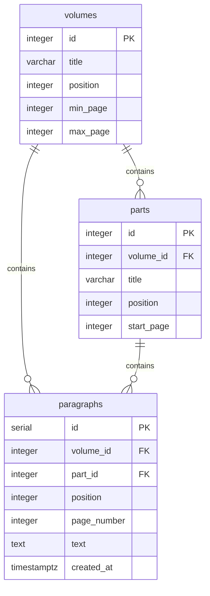
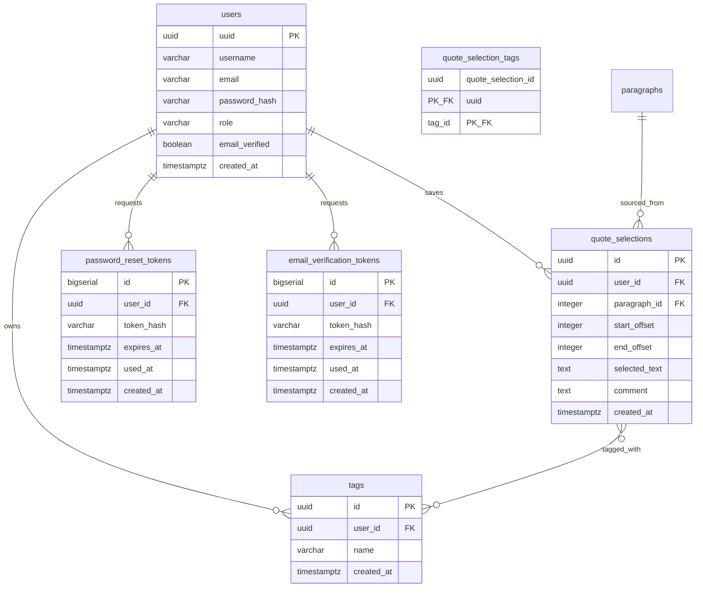

# Data Model

## Corpus

The corpus models the structure of _À la recherche du temps perdu_.

The hierarchy is intentionally simple:

- Volume
- Part
- Paragraph

Paragraphs are the fundamental unit of search, navigation and annotation.

### Key decisions

**`paragraphs.position`** is a global reading-order index across the entire work (unique). It is the canonical ordering key for search results and the future personal timeline.

**`paragraphs.volume_id`** is denormalized — it could be derived through `part_id → parts.volume_id`, but storing it directly avoids a join in the common case.

**`parts.start_page`** is used by the importer to assign each paragraph to its part: `WHERE start_page <= page ORDER BY start_page DESC LIMIT 1`.

**`paragraphs.page_number`** comes from the source text file itself (line markers like `001 |`), not from an external edition reference. It is stable across imports.

**`volumes.min_page`/`max_page`** are computed once by the corpus importer, right after paragraphs are inserted (`volumes` is seeded before any paragraph exists, so the bounds can't be known at seed time). Used by the personal timeline to position bookmarks and draw volume delimiters without recomputing an aggregate on every request. See [timeline-personnelle.md](../features/timeline-personnelle.md).

---

## User data

`users` (auth, MVP step 4), `quote_selections` / `tags` / `quote_selection_tags` (quote saving, MVP step 5), and `password_reset_tokens` / `email_verification_tokens` (auth token flows) are implemented.

### Key decisions

**`users.uuid`** is a UUID (not a serial integer) — avoids enumerable user IDs in URLs and API responses. Generated in Postgres via `gen_random_uuid()` (built into Postgres 13+, no `pgcrypto` extension needed).

**`quote_selections.id` and `tags.id` are UUID** (`DEFAULT gen_random_uuid()`), like `users.uuid` — not the original decision (see history below). Ownership is still enforced the same way it always was: every read, update and delete filters on `user_id` in the query itself (see [Feature doc](../features/quote-save-tags.md)) — the UUID doesn't replace that check, it's defense in depth on top of it. See [ADR-015](ADR-015-opaque-identifiers-for-user-owned-resources.md) for the general rule this follows and why it changed.

*History*: these two columns were originally `SERIAL`; migrated to UUID once the project had no production data left to migrate and changing a PK was still cheap. See ADR-015 for the full reasoning.

**`quote_selections.selected_text`** is stored alongside the offsets for display and debugging — if the corpus text were ever corrected, the saved text remains readable. Once a quote is saved, `selected_text`/`start_offset`/`end_offset` are immutable for now — only its tags and `comment` can change (full editing is a possible future iteration).

**`quote_selections.comment`** (`TEXT NULL`) is an optional personal comment, editable only after creation — never set at creation time. Empty/whitespace-only input is normalized to `NULL` in the service layer, never stored as an empty string. See [quote-save-tags.md](../features/quote-save-tags.md).

**`users.email_verified`** defaults to `FALSE` for new accounts; existing accounts were backfilled to `TRUE` by the migration that introduced the column. See [auth.md](../features/auth.md#email-confirmation-at-registration).

**`password_reset_tokens`/`email_verification_tokens`** each hold one-time tokens for their respective flow: `SecureRandom`-generated, stored hashed (`token_hash`, SHA-256, never the raw token), single-use (`used_at`), time-limited (`expires_at`). Kept as two separate physical tables (rather than one shared table with a `kind` column) so a bug in one flow's queries can't touch the other flow's data, even though the query logic itself is generalized. A partial unique index guarantees at most one active (unused, unexpired) token per user per table. See [auth.md](../features/auth.md#email-confirmation-at-registration) and [reset-password.md](../features/reset-password.md#token-lifecycle).

**Tagging is optional.** A quote selection can have zero tags; a tag can exist without being attached to any quote. The many-to-many relationship is genuinely `0..n ↔ 0..n` in both directions — there is no floor on either side.

**`tags`** are per-user and private — there is no shared tag taxonomy. Uniqueness is `(user_id, name)`, compared case-insensitively after trimming (a `CHECK` constraint guarantees `name` is always already trimmed and non-empty; a unique index on `(user_id, LOWER(name))` enforces the case-insensitive part) — so "Combray" and "combray" cannot both exist for the same user, while the casing a user actually typed is preserved for display.

## Offset convention

Quote selections are stored using character offsets within a paragraph.

- `start_offset` is inclusive.
- `end_offset` is exclusive.
- Offsets are zero-based.

This convention matches `String.substring()` in both Java and JavaScript and allows quote selections to be reconstructed deterministically from the original paragraph text.
