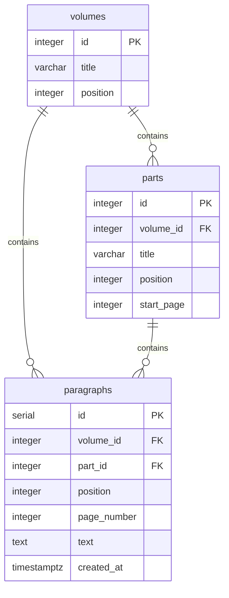
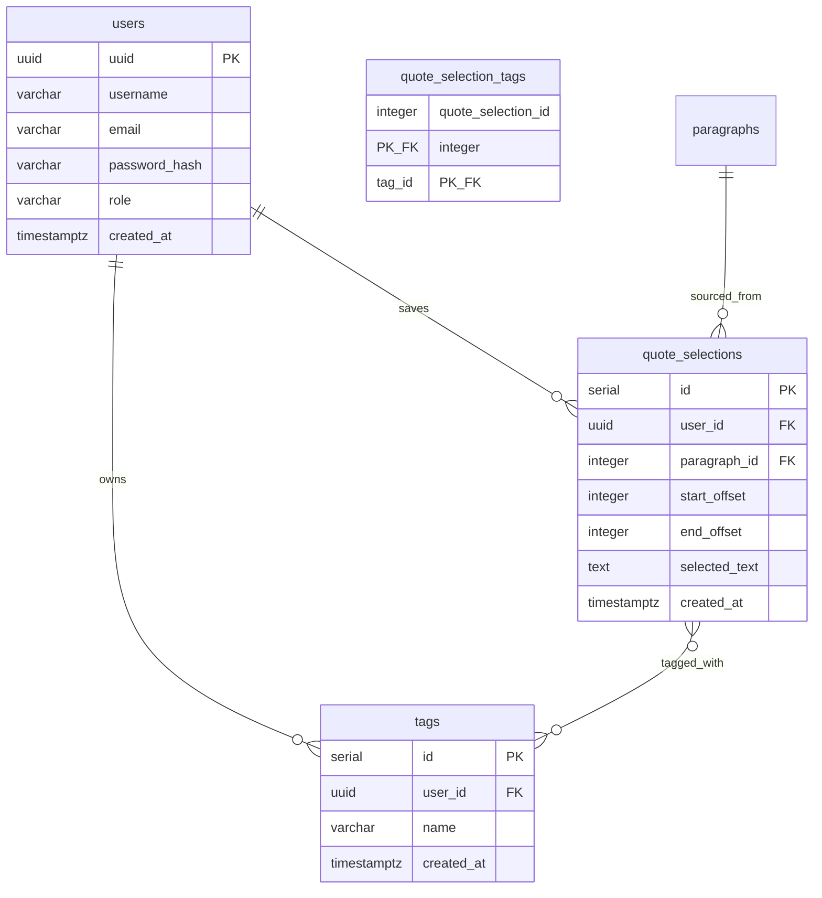

# Data Model

## Corpus

The corpus models the structure of _À la recherche du temps perdu_.

The hierarchy is intentionally simple:

- Volume
- Part
- Paragraph

Paragraphs are the fundamental unit of search, navigation and annotation.

### Key decisions

**`paragraphs.position`** is a global reading-order index across the entire work (unique). It is the canonical ordering key for search results and the future personal timeline.

**`paragraphs.volume_id`** is denormalized — it could be derived through `part_id → parts.volume_id`, but storing it directly avoids a join in the common case.

**`parts.start_page`** is used by the importer to assign each paragraph to its part: `WHERE start_page <= page ORDER BY start_page DESC LIMIT 1`.

**`paragraphs.page_number`** comes from the source text file itself (line markers like `001 |`), not from an external edition reference. It is stable across imports.

---

## User data

`users` (auth, MVP step 4) and `quote_selections` / `tags` / `quote_selection_tags` (quote saving, MVP step 5) are implemented.

### Key decisions

**`users.uuid`** is a UUID (not a serial integer) — avoids enumerable user IDs in URLs and API responses. Generated in Postgres via `gen_random_uuid()` (built into Postgres 13+, no `pgcrypto` extension needed).

**`quote_selections.id` and `tags.id` are plain `SERIAL`, not UUID**, unlike `users.uuid` — deliberately. Ownership of these two tables is never enforced by making their IDs hard to guess; every read, update and delete filters on `user_id` in the query itself (see [Feature doc](../features/quote-save-tags.md)). A sequential ID in a URL like `/api/quotes/42` reveals nothing exploitable under that model, so there is no reason to pay UUID's cost (larger index, less locality) here.

**`quote_selections.selected_text`** is stored alongside the offsets for display and debugging — if the corpus text were ever corrected, the saved text remains readable. Once a quote is saved, `selected_text`/`start_offset`/`end_offset` are immutable for now — only its tags can change (full editing is a possible future iteration).

**Tagging is optional.** A quote selection can have zero tags; a tag can exist without being attached to any quote. The many-to-many relationship is genuinely `0..n ↔ 0..n` in both directions — there is no floor on either side.

**`tags`** are per-user and private — there is no shared tag taxonomy. Uniqueness is `(user_id, name)`, compared case-insensitively after trimming (a `CHECK` constraint guarantees `name` is always already trimmed and non-empty; a unique index on `(user_id, LOWER(name))` enforces the case-insensitive part) — so "Combray" and "combray" cannot both exist for the same user, while the casing a user actually typed is preserved for display.

## Offset convention

Quote selections are stored using character offsets within a paragraph.

- `start_offset` is inclusive.
- `end_offset` is exclusive.
- Offsets are zero-based.

This convention matches `String.substring()` in both Java and JavaScript and allows quote selections to be reconstructed deterministically from the original paragraph text.
