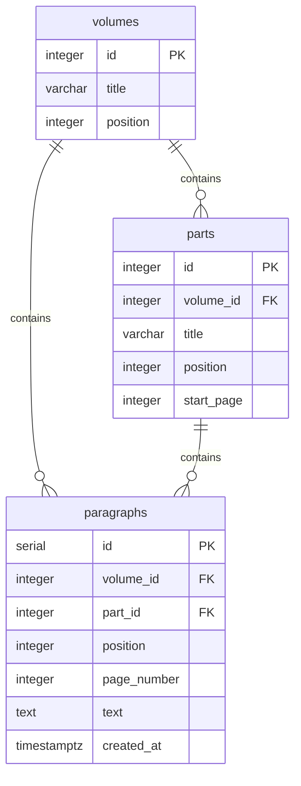
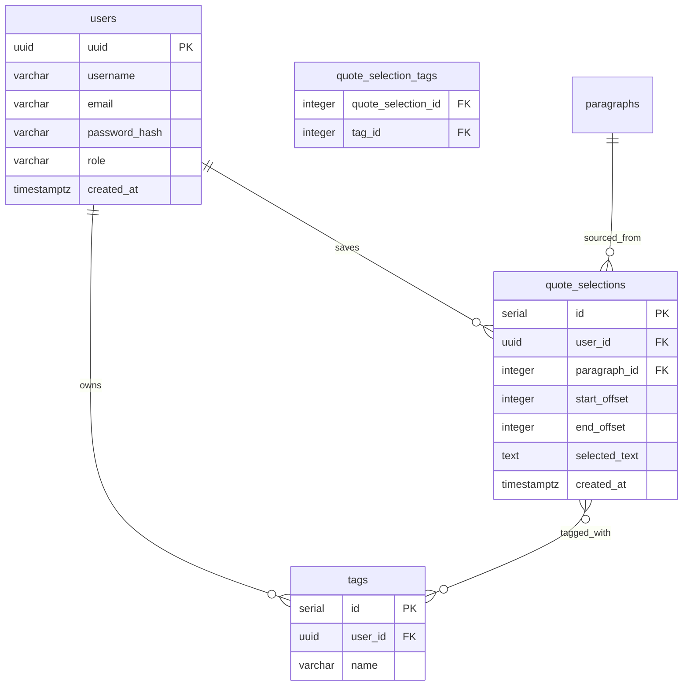

# Data Model

## Corpus

The corpus models the structure of _À la recherche du temps perdu_.

The hierarchy is intentionally simple:

- Volume
- Part
- Paragraph

Paragraphs are the fundamental unit of search, navigation and annotation.

### Key decisions

**`paragraphs.position`** is a global reading-order index across the entire work (unique). It is the canonical ordering key for search results and the future personal timeline.

**`paragraphs.volume_id`** is denormalized — it could be derived through `part_id → parts.volume_id`, but storing it directly avoids a join in the common case.

**`parts.start_page`** is used by the importer to assign each paragraph to its part: `WHERE start_page <= page ORDER BY start_page DESC LIMIT 1`.

**`paragraphs.page_number`** comes from the source text file itself (line markers like `001 |`), not from an external edition reference. It is stable across imports.

---

## User data

`users` is implemented (auth, MVP step 4). `quote_selections`, `tags` and `quote_selection_tags` are defined here but not yet implemented (planned for the quote-saving step).

### Key decisions

**`users.uuid`** is a UUID (not a serial integer) — avoids enumerable user IDs in URLs and API responses. Generated in Postgres via `gen_random_uuid()` (built into Postgres 13+, no `pgcrypto` extension needed).

**`quote_selections.selected_text`** is stored alongside the offsets for display and debugging — if the corpus text were ever corrected, the saved text remains readable.

**`tags`** are per-user and private. There is no shared tag taxonomy.

## Offset convention

Quote selections are stored using character offsets within a paragraph.

- `start_offset` is inclusive.
- `end_offset` is exclusive.
- Offsets are zero-based.

This convention matches `String.substring()` in both Java and JavaScript and allows quote selections to be reconstructed deterministically from the original paragraph text.
